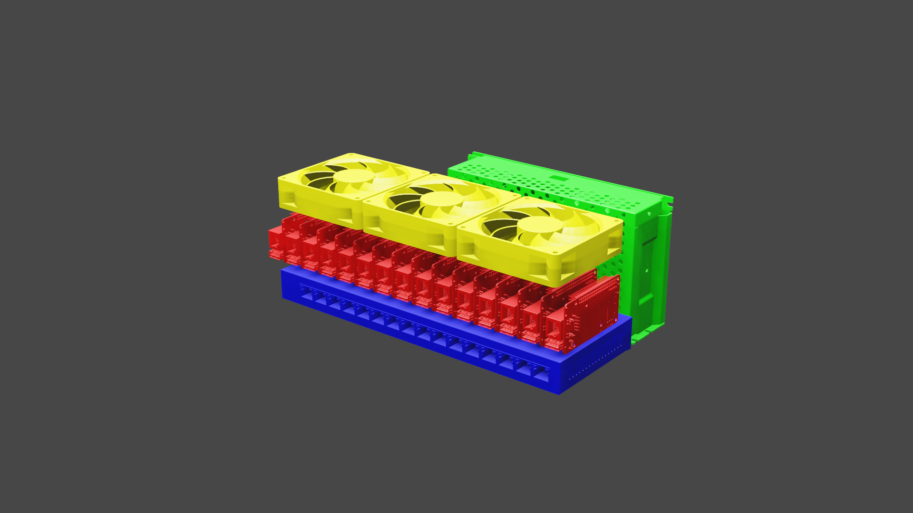
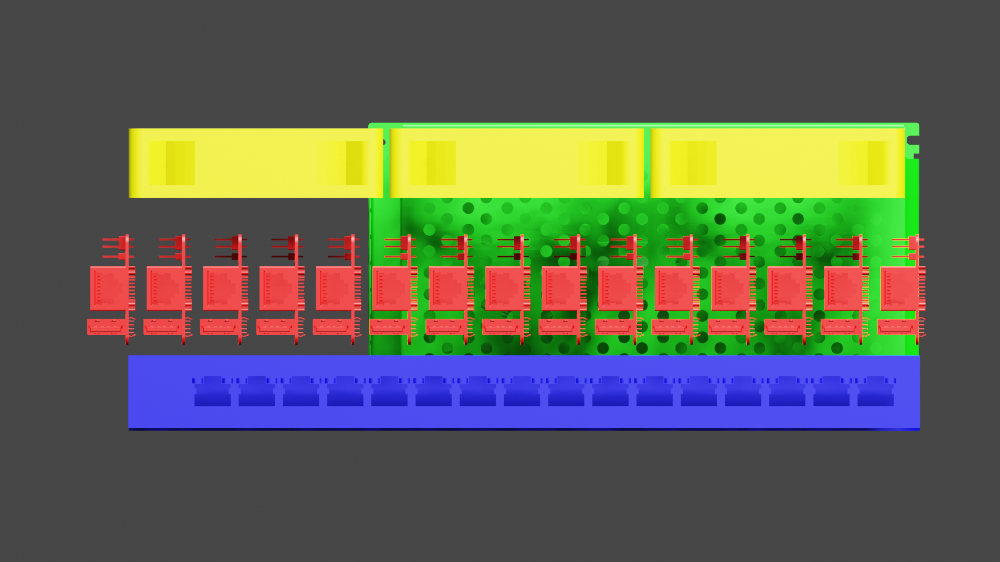
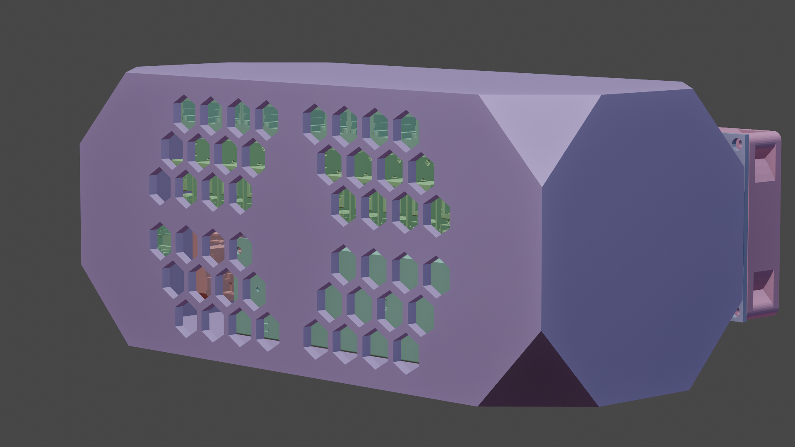
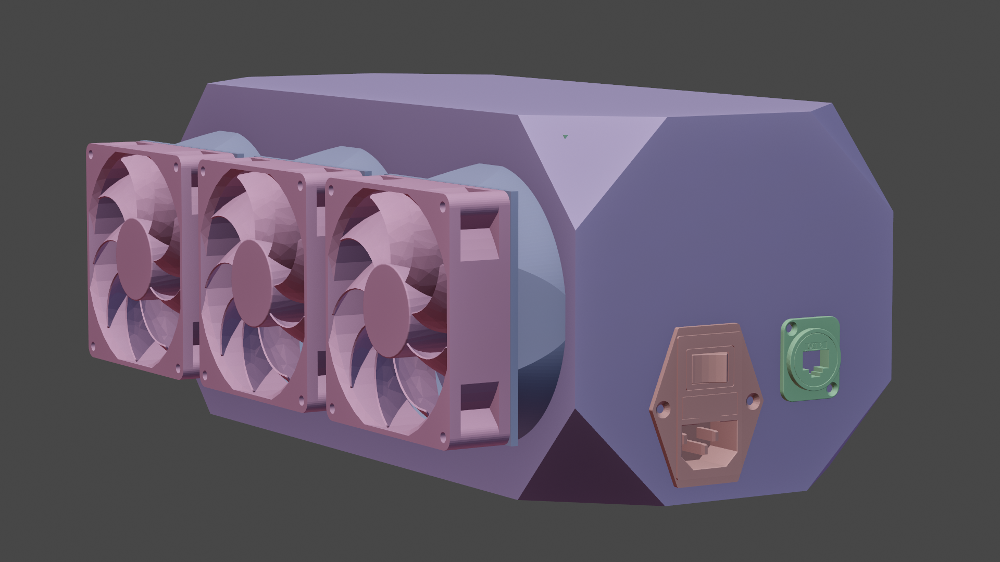
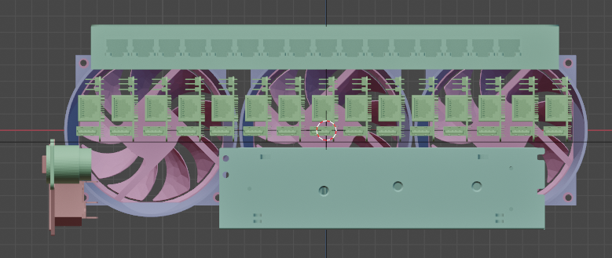
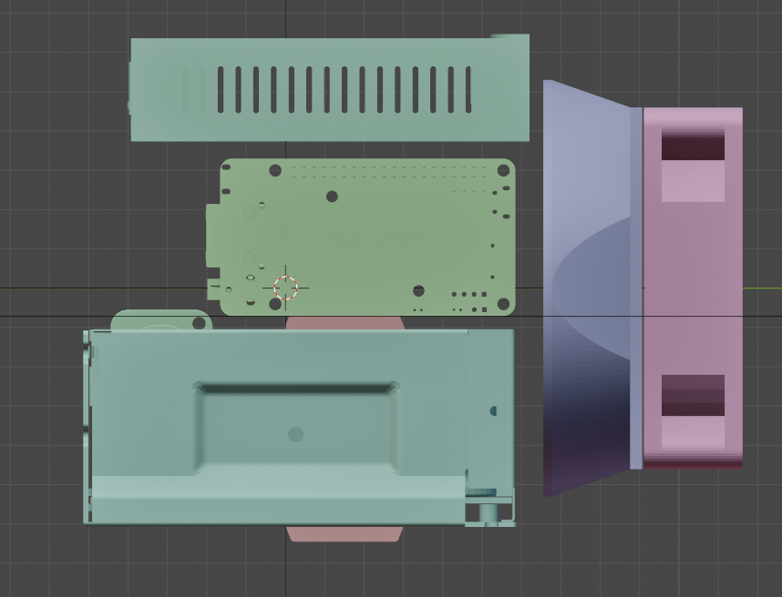
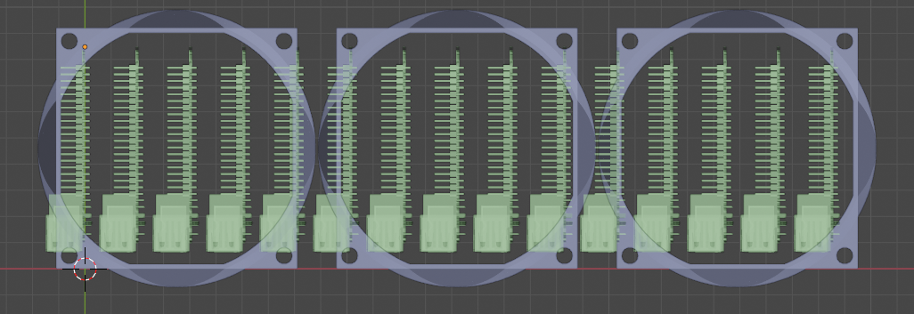

# Hardware and Build

## Rev1

For my first revision of the layout for the cluster I sought to pack everything in the smallest volume possible, with little regard for airflow or how the whole thing would be encased.

||
|---|---|
|||

I didnt do much work at this scale as it didnt get much airflow to a few of the boards.

## Rev2

I then added shrouding and a case, as shown here:

|||
|---|---|
|||

This second revision both added shrouds to encourage airflow acros all the boards, as well as a case, and a slightly improved layout encouraging airflow across the switch, and power supply.

Shown below is a view of the shrouds and the pi below, showing the hope for improved airflow.

I had some fun with the case design... by which I mean I beveled the corners, and added some hexagonal vent holes. This case will likely be 3d printed in 2 or 4 parts, and bonded together, but I may opt to get it laser cut in acryllic once I finalize the design.

As it sits right now, there are cavities for captive m3 nuts to allow for the mounting of the switch, psu, and the stack of SBC. While measuring the Netgear switch's PCB to determin the placement of these captive nuts I found that the mounting points are not quite rectangular, with two inline at 10.5 inches apart, and then one corner being 2.000 inches from the front hole, and the other being 1.975 inches. This is not an issue, just an oddity of that switch's PCB.
